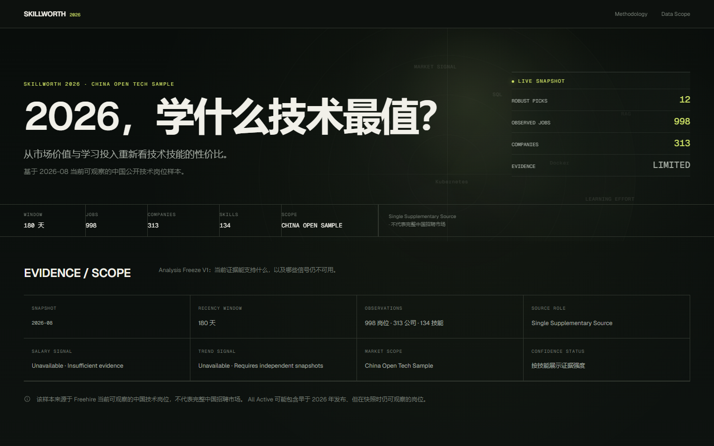
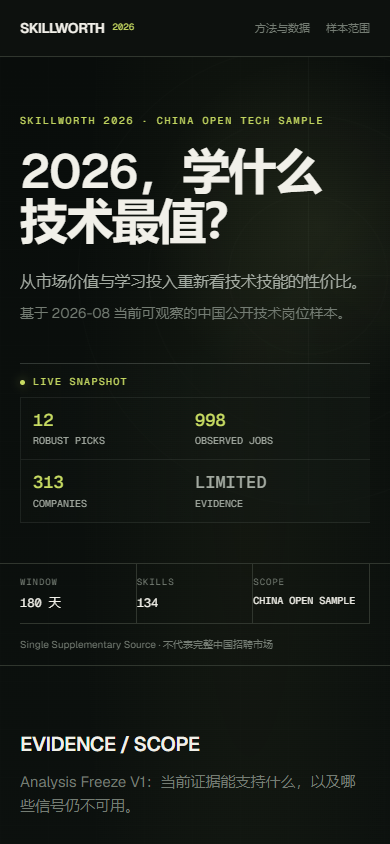
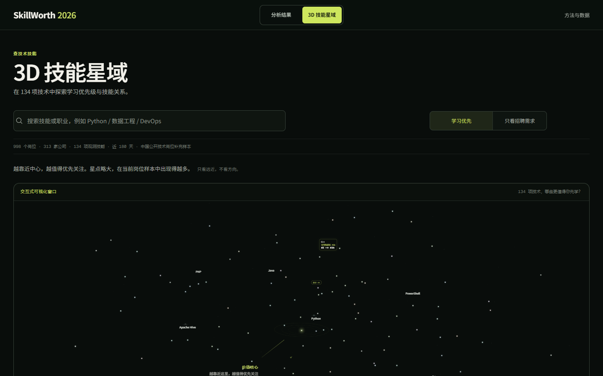
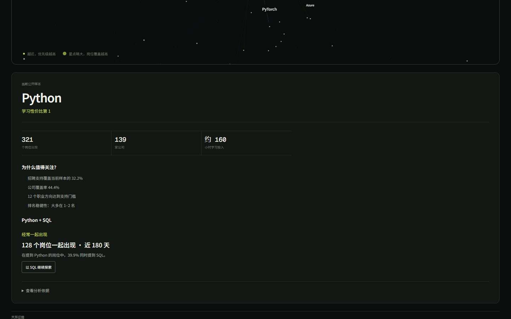
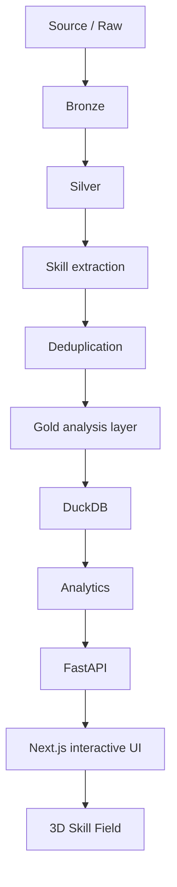

# SkillWorth 2026

> 2026，学什么技术最值？

*Interactive research on technical skill value, learning effort and role fit using 2026 China tech job samples.*

基于 2026-08 当前可观察的中国公开技术岗位补充样本，SkillWorth 把市场信号与透明的学习投入假设放进同一个决策框架：不是只问“什么技能出现得多”，而是观察在特定目标与预算下，下一项技术的学习优先级如何变化。

它是一件可复现的数据分析与交互可视化作品，不是完整中国招聘市场、就业承诺或权威排名。



| 冻结默认窗口 | 规范岗位 | 公司 | 观测技能 | 独立市场来源 |
| --- | ---: | ---: | ---: | ---: |
| 180 天 | 998 | 313 | 134 | 1（补充样本） |

Salary 与 Trend 都是 `unavailable`：这表示当前证据不足，不是数值 0。

## 为什么值得看

普通热门技能榜回答“市场上什么出现得多”。SkillWorth 额外考虑公司与岗位覆盖、技能协同、证据稳定性和显式的学习投入，因此可以把“需求”与“学习优先级”分开讨论。

- `Market Signal`：需求强度、公司广度、角色广度、技能协同与置信度的组合。
- `SkillWorth`：将 Market Signal 与 Expected Learning Effort 放入同一决策框架。
- `Role fit`：同一技能在不同岗位目标下的相对位置会改变。

学习投入是版本化的透明假设，不是市场观测事实，也不是对个人学习结果的承诺。

## 五个已冻结发现

### 1. 效率前沿不是万能榜单

在当前候选门槛与学习投入假设下，Python、SQL、Git 构成效率前沿：它们分别在不同投入水平上提供更高的市场信号。这不是“人人都该先学它们”的结论。

### 2. Demand ≠ SkillWorth

C++ 在当前样本中需求排名第 3，但在约 260 小时的从零学习投入假设下，SkillWorth 排名为第 35。这不等于 C++ 不值得学，而是说明高需求不会自动转化为相同的学习优先级。

### 3. 岗位目标会改变答案

在 DevOps 的 21 个岗位样本中，Kubernetes 从全局第 18 升至角色内第 1，Terraform 从第 33 升至第 3；Data Engineer 的 38 个岗位样本中，SQL、Spark、Kafka 的位置更靠前。细分样本有限，结论应连同分母阅读。

### 4. 技能以技术栈出现

Python–SQL 具有更大的共同出现规模；NumPy–Pandas 与 Grafana–Prometheus 则显示更强的专业亲和度。共同出现表示关联，不表示因果或必然的学习顺序。

### 5. 相信稳健核心，不迷信每一个名次

Python、SQL、Git、Docker 在不同权重与学习投入情景中保持稳定；Tableau、RAG、Azure 的精确位次更敏感。180d 与其他重叠时间窗口的相关性不构成 Trend 结论。

## 交互研究界面

| 首页（桌面） | 首页（390 px） |
| --- | --- |
|  |  |

| 3D 技能星域 | 技能关系浏览 |
| --- | --- |
|  |  |

- `/`：从价值—投入前沿进入技能探索与岗位视角。
- `/skill-field`：真实排名与只读关系证据驱动的 3D 技能星域，支持搜索聚焦、相机飞行、关系星座、移动端与 reduced motion。
- `/methodology`：说明公式、口径、空值语义与数据限制。

## 方法与数据边界



Demo Mode 由版本化的合成 fixture 重建，供任何 clone 运行和 CI 验证。Real Mode 使用本地、未提交的 Freehire v6 manifest 与派生产物；仓库不分发完整 Real source dataset。

当前中国观察仅有一个 Freehire 补充来源，不代表完整中国技术招聘市场；52.40% 的 180d 岗位归为 `role=other`；Gold Benchmark / Gold Labels 尚未达到可发布 Precision、Recall 或 F1 的条件。完整口径见 [方法论](docs/METHODOLOGY.md)、[数据字典](docs/DATA_DICTIONARY.md) 与 [数据来源](docs/DATA_SOURCES.md)。

## 工程实现

| 层 | 技术 |
| --- | --- |
| 前端 | Next.js、React、TypeScript、Tailwind CSS |
| 可视化 | ECharts SVG、Three.js、React Three Fiber、Drei |
| API | FastAPI、Pydantic |
| 数据与分析 | Python、Polars、DuckDB、Parquet、NetworkX |
| 验证 | pytest、Vitest、Playwright |

前端只消费 API / analytics 输出，不在页面重算排名或硬编码分析数值。目录职责和边界见 [架构文档](docs/ARCHITECTURE.md)。

## 快速开始：Demo Mode

以下命令使用公开合成数据，不需要 Real artifact。

```powershell
python -m venv .venv
.\.venv\Scripts\python.exe -m pip install -e ".[dev]"
Set-Location apps\web
npm ci
```

在仓库根目录启动 API：

```powershell
$env:PYTHONPATH='packages/data-pipeline/src;packages/analytics/src;apps/api/src'
$env:SKILLWORTH_DATA_MODE='demo'
.\.venv\Scripts\python.exe -m uvicorn skillworth_api.main:app --host 127.0.0.1 --port 8011
```

另开终端启动 Web：

```powershell
Set-Location apps\web
$env:SKILLWORTH_API_URL='http://127.0.0.1:8011'
npm run dev
```

打开 `http://127.0.0.1:3000`。Real Mode 需要本地 `data/modes/freehire/current.json` 或等价 manifest；不要将该 artifact、Raw JD 或 warehouse 提交到仓库。

## 验证

```powershell
.\.venv\Scripts\python.exe -m pytest
.\.venv\Scripts\python.exe -m pip check
Set-Location apps\web
npm run lint
npm run typecheck
npm run test -- --run
npm run build
npm run test:e2e
```

`npm run test:e2e` 为确定性 Demo E2E。`npm run test:e2e:real` 仅在本地 Real artifact 可用时验证冻结断言，不属于公开 CI。

## 仓库结构

```text
apps/       FastAPI 与 Next.js 应用
packages/   数据管道与分析模块
data/       Demo fixture、schema、taxonomy 与版本化配置
docs/       方法、架构、来源和数据治理文档
tests/      Python 测试
```

## 数据权利与许可证

代码和项目原创文档采用 [MIT License](LICENSE)。第三方招聘文本、外部数据集、商标与依赖仍受各自条款约束；本仓库不批量再分发完整招聘记录。详见 [数据权利边界](DATA_RIGHTS.md) 与 [第三方声明](THIRD_PARTY_NOTICES.md)。

## 仓库历史说明

Git history begins from the reconstructed baseline established on 2026-08-24. Earlier development history was not recoverable, so commits before that baseline are unavailable for audit.

## 为什么做这个项目

普通的热门技能排行榜回答：

> 市场上什么出现得多？

但学习者真正关心的是：

> 考虑需求、覆盖范围、技术协同和学习投入后，下一项技术最值得学什么？

**Demand ≠ Learning Priority（需求不等于学习优先级）。**

这正是 SkillWorth 与普通招聘市场 Dashboard 的区别：它不仅统计技能出现了多少次，还考察技能覆盖多少公司和岗位类型、与其他技能如何共同出现、证据是否稳定，以及从零学习所需投入的模型假设。

## 数据概览

当前公开分析使用冻结的 v6 数据：

| 口径 | 规范岗位 | 公司 | 观测技能 |
| --- | ---: | ---: | ---: |
| 默认 `180d` 窗口 | 998 | 313 | 134 |
| `all-active` 全部活跃记录 | 1,140 | 339 | 138 |

| 项目 | 当前口径 |
| --- | --- |
| Snapshot | `freehire_china_tech_2026_08` |
| Market scope | China Open Tech Sample（`china_open_tech_sample`） |
| Source role | `china_supplementary` |
| 独立市场来源 | 1（Freehire） |
| Salary | `unavailable` |
| Trend | `unavailable` |

这些数据是 **Freehire 当前可观察的中国技术岗位补充样本**，不代表完整中国技术招聘市场。数据中记录的 38 个 upstream ATS/catalogue labels 用于来源追踪，不是 38 个独立市场来源。

数据来源、访问方式与授权边界见 [DATA_SOURCES.md](docs/DATA_SOURCES.md) 和 [FREEHIRE_USAGE_AUDIT.md](docs/FREEHIRE_USAGE_AUDIT.md)。

## 五个主要发现

### 1. 效率前沿：Python → SQL → Git

在当前候选门槛和学习投入假设下，Python、SQL、Git 构成可发布的效率前沿：在不同投入水平上，它们提供了更高的市场信号。

| 技能 | Market Signal | 预期学习投入 | SkillWorth | 排名 |
| --- | ---: | ---: | ---: | ---: |
| Python | 48.05 | 160h | 24.03 | #1 |
| SQL | 36.32 | 100h | 22.35 | #2 |
| Git | 21.68 | 55h | 16.13 | #3 |

这里的小时数是“从零达到可用于初级岗位任务”的透明模型假设，不是精确课程时长，也不是对个人学习结果的承诺。

### 2. 高需求不自动等于高 SkillWorth

C++ 是最清楚的反例：

| 指标 | C++ |
| --- | ---: |
| 岗位数 | 92 |
| 需求排名 | #3 |
| 公司数 | 48 |
| Market Signal | 24.76 |
| 预期学习投入 | 260h |
| SkillWorth | 9.43 |
| SkillWorth 排名 | #35 |

这并不表示“C++ 不值得学”。更准确的结论是：**在当前从零学习投入假设下，C++ 的高市场需求没有转化成同样高的 SkillWorth 排名。**

### 3. 目标岗位改变，答案也会改变

不存在一个适用于所有技术岗位的最佳学习顺序。

| 角色切片 | 技能 | 角色内覆盖 | 全局排名 → 角色排名 |
| --- | --- | ---: | ---: |
| DevOps，n=21 | Kubernetes | 17/21 = 80.95% | #18 → #1 |
| DevOps，n=21 | Terraform | 11/21 = 52.38% | #33 → #3 |
| Data Engineer，n=38 | Apache Spark | 22/38 = 57.89% | #19 → #3 |
| Data Engineer，n=38 | Kafka | 12/38 = 31.58% | #23 → #5 |

这些结果说明职业目标会改变技能优先级，但 `DevOps n=21` 和 `Data Engineer n=38` 都是有限样本，不能包装成完整市场定论。

### 4. 技能往往以技术栈出现

在 `all-active` 的 1,140 个 canonical jobs 技能图中：

| 技能组合 | 共同出现的岗位 | Jaccard | PMI | 主要含义 |
| --- | ---: | ---: | ---: | --- |
| Python–SQL | 141 | 0.3431 | 0.8565 | 规模强，搭配广泛 |
| NumPy–Pandas | 12 | 0.6667 | 4.1255 | 亲和度强，更专业化 |
| Grafana–Prometheus | 11 | 0.5789 | 4.0385 | 亲和度强，更专业化 |

`co-occurrence count` 回答“共同出现了多少次”；Jaccard 和 PMI 更关注“两项技能彼此关联得有多紧”。因此 Python–SQL 可以在规模上更强，而 NumPy–Pandas、Grafana–Prometheus 在专业亲和度上更突出。

共现只表示当前样本中的关联，不代表因果关系，也不表示这些技能必须一起学。

### 5. 相信稳健核心，不迷信每一个名次

SkillWorth 用多个权重和学习投入情景检查排名对模型假设是否敏感：

| 相对稳定的头部 | 排名区间 | 对假设敏感的技能 | 排名区间 |
| --- | ---: | --- | ---: |
| Python | 1–2 | Tableau | 7–25 |
| SQL | 1–2 | RAG | 6–29 |
| Git | 3–4 | Azure | 8–27 |
| Docker | 3–4 |  |  |

头部存在一个 **Robust Core（稳健核心）**，但长尾的精确名次不应被当成确定事实。

作为辅助证据，180d 排名与 90d、365d、all-active 窗口的 Spearman 秩相关为 0.989–0.998。它不能被解释为 Trend：这些发布时间窗口高度重叠，而且协同信号共用 all-active 技能图。

## SkillWorth Frontier

Frontier 是本项目的标志性可视化：

- X 轴：Expected Learning Effort，越向左表示预期学习投入越低。
- Y 轴：Market Signal，越向上表示当前样本中的市场信号越强。
- 效率前沿：在不同投入水平下，没有被“学习投入更低且市场信号更高”的候选完全压过的技能。

Python 提供最高的市场信号，SQL 用更低投入取得较强信号，Git 则以更低投入保留有意义的市场支持，所以三者进入当前前沿。

Frontier 不是“科学证明最应该学什么”。它是在当前样本、候选门槛和显式学习投入假设下形成的决策辅助分析。

## SkillWorth 如何工作

第一步，把招聘市场中的多类证据合成为 Market Signal：

```text
Demand Strength（需求强度）
+ Company Breadth（公司覆盖广度）
+ Role Breadth（岗位类型广度）
+ Skill Synergy（技能协同）
+ Confidence（证据置信度）
                    ↓
              Market Signal
```

第二步，把市场信号和学习投入放在同一决策框架中：

```text
Market Signal + Expected Learning Effort
                    ↓
                SkillWorth
```

这些名称表达的是计算概念，不是另写的一套简化公式。真实公式、权重、门槛、分母、过滤条件与已知局限以 [METHODOLOGY.md](docs/METHODOLOGY.md) 为准；字段和空值语义见 [DATA_DICTIONARY.md](docs/DATA_DICTIONARY.md)。

## 范围与限制

### 单一补充来源

当前中国样本主要来自 Freehire，独立市场来源仍然是 1。因此结果只能描述当前可观察样本，不能代表完整中国技术招聘市场。

### Salary：不可用

当前没有足够的可比较人民币薪资证据。`unavailable` 表示证据不足，不是数值 0；项目不会用职位标题猜测薪资或静默换汇。

### Trend：不可用

当前只有一个固定 snapshot。90d、180d、365d 是同一快照中的 posting recency windows，不是多期独立市场快照，因此不能产生增长、动量或趋势结论。

### Learning Effort：模型假设

学习时长是版本化、可查看的估算，用于比较投入情景。它不是客观学习周期，也不是个人完成课程所需时间。

### Role Coverage：细分样本有限

180d 窗口中有 523/998（52.40%）岗位被归为 `role=other`。角色细分发现应视为有限样本观察，尤其不能忽略 `DevOps n=21` 与 `Data Engineer n=38` 的分母。

### Skill Extraction：存在文本污染风险

当前采用版本化 taxonomy 和规则优先抽取。宽泛的 AI、Optimization 等词可能来自公司介绍或职位背景，而非明确技能要求；项目不宣称技能抽取达到研究级准确率。

### Dedup：经过审计，但不是“完全去重”

项目对已知 8 个 canonical merge groups 做了 provenance 审计：6 个误合并已纠正，2 个保守保留。这不等于所有重复岗位已经完全消除。

## 数据管道

```text
Raw
  ↓
Bronze（原始事实，只追加）
  ↓
Silver（标准化记录）
  ↓
Skill Extraction
  ↓
Dedup / Canonical Jobs
  ↓
Gold（分析实体）
  ↓
DuckDB Warehouse
  ↓
Analysis Views
  ↓
FastAPI
  ↓
Next.js
```

管道保留每条岗位记录的 provenance，使用固定快照和 source gating 控制可复现范围；去重后的 canonical job 仍能追溯原始来源。技能 taxonomy、质量报告和分析配置均版本化。未获得明确合法授权的数据源默认关闭，只允许手动导入或授权 Connector。

这里的 Gold 是分析就绪的 **Gold Data Layer**。人工评测真值另称 **Gold Benchmark / Gold Labels**；两者不是同一概念。

## 工程实现

项目后半部分支撑前面的分析结论，而不是在前端重复计算指标：

- **数据与分析**：Python、Parquet、DuckDB；Bronze / Silver / Gold 分层、数据质量检查、技能图与敏感性分析。
- **服务契约**：FastAPI、Pydantic；负责参数验证和查询编排，指标公式留在可测试的 analytics 模块。
- **交互可视化**：Next.js、React、TypeScript；展示 API 返回的真实分析结果，并处理筛选、空状态和响应式布局。
- **可追溯性**：固定 snapshot、source provenance、canonical job 映射和版本化配置。
- **测试**：pytest、Vitest、Playwright，覆盖数据管道、分析、API、组件和主要用户路径。

仓库目录职责与关键架构决策见 [ARCHITECTURE.md](docs/ARCHITECTURE.md)。项目还预留了人工 Gold Evaluation infrastructure，包括固定样本、评估器和标注工作区；V1 没有正式 Gold 结果，因此不发布 Precision、Recall 或 F1。

## 当前验证

2026-08-24 在 reconstructed baseline 及 data-integrity hardening 集成后重新核验：

| 检查 | 结果 |
| --- | --- |
| Python test suite | 239 passed，1 条既有 Starlette/httpx deprecation warning |
| pip check | passed |
| ESLint | passed |
| TypeScript | passed |
| Vitest | 17 passed |
| Demo E2E | 30 passed |
| Real E2E | 61 passed，3 项设备条件 skip，0 failed |
| Next.js production build | passed |

运行相同检查：

```powershell
.\.venv\Scripts\python.exe -m pytest
Set-Location apps\web
npm run lint
npm run typecheck
npm run test -- --run
npm run build
npm run test:e2e
```

`npm run test:e2e` 会从已提交的 `data/demo` 合成 fixture 重建隔离、确定性的 Demo 数据，不依赖本机 Real 数据。冻结 Freehire v6 数据故事验证使用 `npm run test:e2e:real`；该命令要求本地存在 `data/modes/freehire/current.json`，或通过 `SKILLWORTH_REAL_MODE_MANIFEST` 指向等价的本地 manifest。

## 本地运行

Windows PowerShell：

```powershell
python -m venv .venv
.\.venv\Scripts\python.exe -m pip install -e ".[dev]"
Set-Location apps\web
npm ci
```

复制 `.env.example` 后启动 Demo API：

```powershell
Set-Location ..\..
$env:PYTHONPATH='packages/data-pipeline/src;packages/analytics/src;apps/api/src'
$env:SKILLWORTH_DATA_MODE='demo'
.\.venv\Scripts\python.exe -m uvicorn skillworth_api.main:app --host 127.0.0.1 --port 8011
```

另开终端启动 Web：

```powershell
Set-Location apps\web
$env:SKILLWORTH_API_URL='http://127.0.0.1:8011'
npm run dev
```

浏览器打开 `http://127.0.0.1:3000`。Real Mode 需要本地已构建且不进入版本控制的 manifest；不要提交真实 Raw / Bronze / Silver / Gold 数据。

## 后续研究

- 按月保存相互独立的 snapshot，才能分析真实 Trend。
- 增加第二个许可清晰的中国来源，增强跨来源证据。
- 补充更丰富、可比较的人民币薪资证据。
- 可选地完成正式人工 Gold evaluation。

## 数据归属与代码许可

Freehire 的数据来源说明和访问边界见 [DATA_SOURCES.md](docs/DATA_SOURCES.md)、[FREEHIRE_USAGE_AUDIT.md](docs/FREEHIRE_USAGE_AUDIT.md) 与 [THIRD_PARTY_NOTICES.md](THIRD_PARTY_NOTICES.md)。第三方招聘文本的权利与项目代码许可相互独立；未来采用某种代码许可证，也不会自动获得第三方 JD 的再分发授权。

SkillWorth 自主创作的源代码与项目文档采用 [MIT License](LICENSE)。该许可不覆盖第三方软件、招聘文本、外部数据集、商标或其他第三方内容；这些内容仍受各自许可、条款和权利边界约束，详见 [THIRD_PARTY_NOTICES.md](THIRD_PARTY_NOTICES.md)。

## Git 基线 provenance

本仓库 Git 历史自 2026-08-24 重建基线开始；此前开发历史未能恢复，因此无法对基线之前的 Git 历史进行完整审计。

Git history begins from the reconstructed baseline established on 2026-08-24. Earlier development history was not recoverable.
