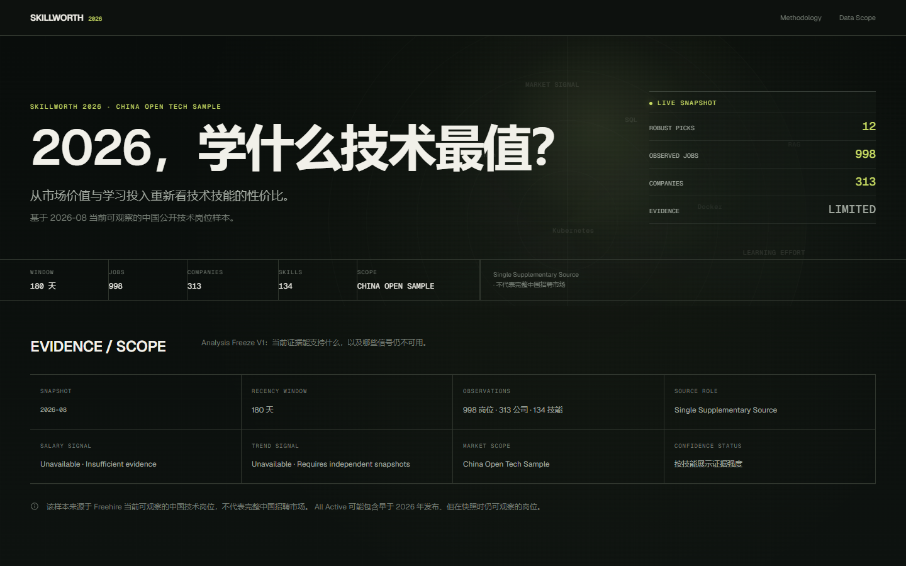
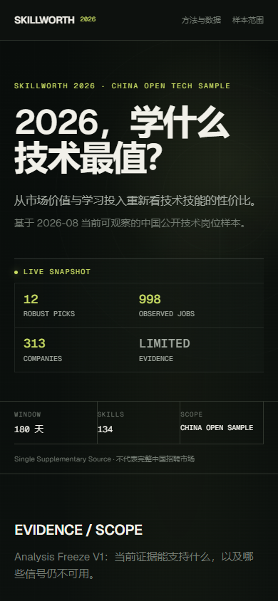
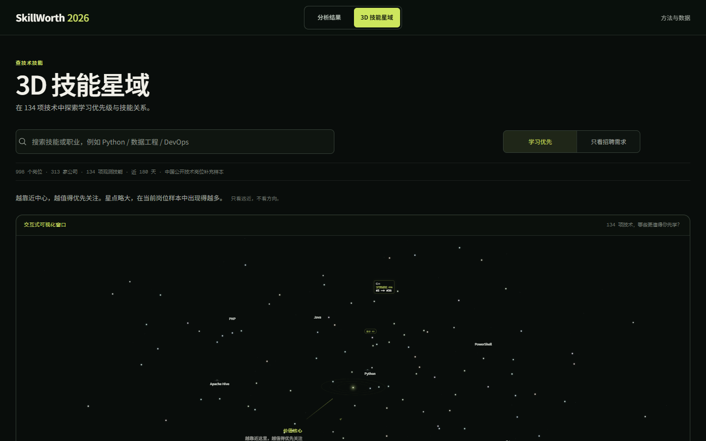
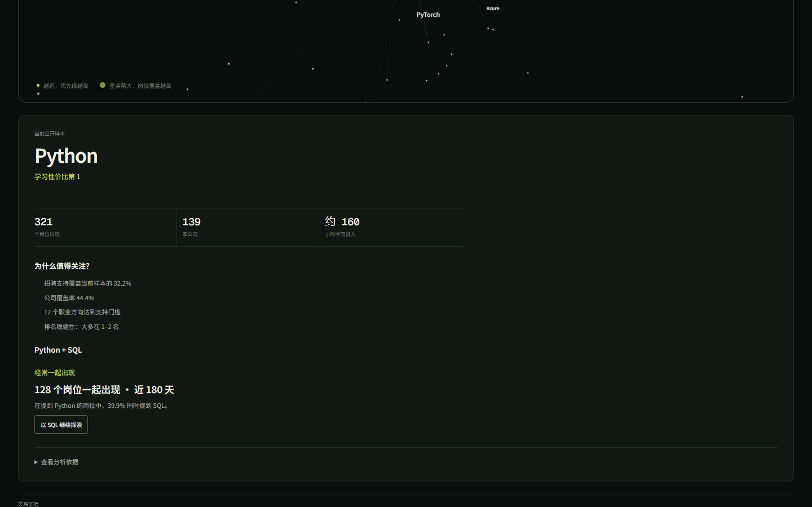
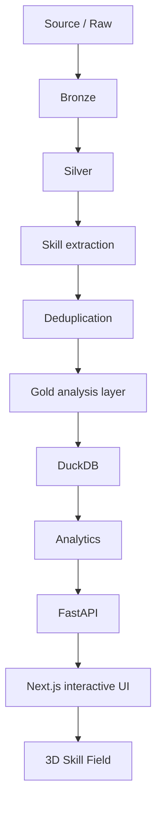

# SkillWorth 2026

[](https://github.com/tcjyq/skillworth-2026/actions/workflows/ci.yml)

> 2026，学什么技术最值？

*Interactive research on technical skill value, learning effort and role fit using 2026 China tech job samples.*

基于 2026-08 当前可观察的中国公开技术岗位补充样本，SkillWorth 把市场信号与透明的学习投入假设放进同一个决策框架：不是只问“什么技能出现得多”，而是观察在特定目标与预算下，下一项技术的学习优先级如何变化。

它是一件可复现的数据分析与交互可视化作品，不是完整中国招聘市场、就业承诺或权威排名。



| 冻结默认窗口 | 规范岗位 | 公司 | 观测技能 | 独立市场来源 |
| --- | ---: | ---: | ---: | ---: |
| 180 天 | 998 | 313 | 134 | 1（补充样本） |

Salary 与 Trend 都是 `unavailable`：这表示当前证据不足，不是数值 0。

## 为什么值得看

普通热门技能榜回答“市场上什么出现得多”。SkillWorth 额外考虑公司与岗位覆盖、技能协同、证据稳定性和显式的学习投入，因此可以把“需求”与“学习优先级”分开讨论。

- `Market Signal`：需求强度、公司广度、角色广度、技能协同与置信度的组合。
- `SkillWorth`：将 Market Signal 与 Expected Learning Effort 放入同一决策框架。
- `Role fit`：同一技能在不同岗位目标下的相对位置会改变。

学习投入是版本化的透明假设，不是市场观测事实，也不是对个人学习结果的承诺。

## 五个已冻结发现

### 1. 效率前沿不是万能榜单

在当前候选门槛与学习投入假设下，Python、SQL、Git 构成效率前沿：它们分别在不同投入水平上提供更高的市场信号。这不是“人人都该先学它们”的结论。

### 2. Demand ≠ SkillWorth

C++ 在当前样本中需求排名第 3，但在约 260 小时的从零学习投入假设下，SkillWorth 排名为第 35。这不等于 C++ 不值得学，而是说明高需求不会自动转化为相同的学习优先级。

### 3. 岗位目标会改变答案

在 DevOps 的 21 个岗位样本中，Kubernetes 从全局第 18 升至角色内第 1，Terraform 从第 33 升至第 3；Data Engineer 的 38 个岗位样本中，SQL、Spark、Kafka 的位置更靠前。细分样本有限，结论应连同分母阅读。

### 4. 技能以技术栈出现

Python–SQL 具有更大的共同出现规模；NumPy–Pandas 与 Grafana–Prometheus 则显示更强的专业亲和度。共同出现表示关联，不表示因果或必然的学习顺序。

### 5. 相信稳健核心，不迷信每一个名次

Python、SQL、Git、Docker 在不同权重与学习投入情景中保持稳定；Tableau、RAG、Azure 的精确位次更敏感。180d 与其他重叠时间窗口的相关性不构成 Trend 结论。

## 交互研究界面

| 首页（桌面） | 首页（390 px） |
| --- | --- |
|  |  |

| 3D 技能星域 | 技能关系浏览 |
| --- | --- |
|  |  |

- `/`：从价值—投入前沿进入技能探索与岗位视角。
- `/skill-field`：真实排名与只读关系证据驱动的 3D 技能星域，支持搜索聚焦、相机飞行、关系星座、移动端与 reduced motion。
- `/methodology`：说明公式、口径、空值语义与数据限制。
- `/methodology` 同页给出安全产物日期、质量分母、三个可复核分析问题和已有敏感性范围；合成 SQL 复核与贡献边界见下方证据文档。

## 方法与数据边界


```mermaid
flowchart TD
  S[Source / Raw] --> B[Bronze]
  B --> SI[Silver]
  SI --> E[Skill extraction]
  E --> D[Deduplication]
  D --> G[Gold analysis layer]
  G --> W[DuckDB]
  W --> A[Analytics]
  A --> API[FastAPI]
  API --> UI[Next.js interactive UI]
  UI --> F[3D Skill Field]
```

Demo Mode 由版本化的合成 fixture 重建，供任何 clone 运行和 CI 验证。Real Mode 使用本地、未提交的 Freehire v6 manifest 与派生产物；仓库不分发完整 Real source dataset。

当前中国观察仅有一个 Freehire 补充来源，不代表完整中国技术招聘市场；52.40% 的 180d 岗位归为 `role=other`；Gold Benchmark / Gold Labels 尚未达到可发布 Precision、Recall 或 F1 的条件。完整口径见 [方法论](docs/METHODOLOGY.md)、[数据字典](docs/DATA_DICTIONARY.md) 与 [数据来源](docs/DATA_SOURCES.md)。

## 工程实现

| 层 | 技术 |
| --- | --- |
| 前端 | Next.js、React、TypeScript、Tailwind CSS |
| 可视化 | ECharts SVG、Three.js、React Three Fiber、Drei |
| API | FastAPI、Pydantic |
| 数据与分析 | Python、Polars、DuckDB、Parquet、NetworkX |
| 验证 | pytest、Vitest、Playwright |

前端只消费 API / analytics 输出，不在页面重算排名或硬编码分析数值。目录职责和边界见 [架构文档](docs/ARCHITECTURE.md)。

## 快速开始：Demo Mode

以下命令使用公开合成数据，不需要 Real artifact。

```powershell
python -m venv .venv
.\.venv\Scripts\python.exe -m pip install -e ".[dev]"
Set-Location apps\web
npm ci
```

在仓库根目录启动 API：

```powershell
$env:PYTHONPATH='packages/data-pipeline/src;packages/analytics/src;apps/api/src'
$env:SKILLWORTH_DATA_MODE='demo'
.\.venv\Scripts\python.exe -m uvicorn skillworth_api.main:app --host 127.0.0.1 --port 8011
```

另开终端启动 Web：

```powershell
Set-Location apps\web
$env:SKILLWORTH_API_URL='http://127.0.0.1:8011'
npm run dev
```

打开 `http://127.0.0.1:3000`。Real Mode 需要本地 `data/modes/freehire/current.json` 或等价 manifest；不要将该 artifact、Raw JD 或 warehouse 提交到仓库。

## 验证

```powershell
.\.venv\Scripts\python.exe -m pytest
.\.venv\Scripts\python.exe -m pip check
Set-Location apps\web
npm run lint
npm run typecheck
npm run test -- --run
npm run build
npm run build:vinext
npm run test:e2e
npm run test:e2e:production-safe
```

`npm run test:e2e` 为确定性 Demo E2E；`npm run test:e2e:production-safe` 构建并启动本地 vinext Worker，验证安全聚合和只读边界。`npm run build` 是 Next 构建检查，实际公开 Worker 使用 `build:vinext`。`npm run test:e2e:real` 仅在本地 Real artifact 可用时验证冻结断言，不属于公开 CI。

[分析与 SQL 复核](docs/ANALYSIS_EVIDENCE.md) · [招聘证据与贡献边界](docs/candidate-evidence.md) · [当前发布审阅状态](docs/RELEASE_READINESS.md)。公开站点消费预计算聚合；本地完整管线和岗位级优化能力不等于线上已开放功能。

## 仓库结构

```text
apps/       FastAPI 与 Next.js 应用
packages/   数据管道与分析模块
data/       Demo fixture、schema、taxonomy 与版本化配置
docs/       方法、架构、来源和数据治理文档
tests/      Python 测试
```

## 数据权利与许可证

代码和项目原创文档采用 [MIT License](LICENSE)。第三方招聘文本、外部数据集、商标与依赖仍受各自条款约束；本仓库不批量再分发完整招聘记录。详见 [数据权利边界](DATA_RIGHTS.md) 与 [第三方声明](THIRD_PARTY_NOTICES.md)。

## 仓库历史说明

Git history begins from the reconstructed baseline established on 2026-08-24. Earlier development history was not recoverable, so commits before that baseline are unavailable for audit.
