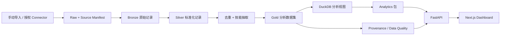

# 架构说明

## 1. 架构目标

SkillWorth 采用“数据产品优先”的 monorepo 结构：数据接入、数据处理、指标计算、API 和展示层彼此隔离。这样可以确保一个 Dashboard 数字始终可沿着 API → analytics → Gold → Silver/Bronze → 原始来源回溯。

当前主链路固定为：Raw → Bronze → Silver → Gold Data Layer → DuckDB → Analytics → API → Web。Gold Data Layer 是分析就绪数据，不等于人工 Gold Benchmark / Gold Labels。



## 2. Monorepo 目录结构

```text
.
├── apps/
│   ├── api/                  # FastAPI 路由、schema、服务组合
│   └── web/                  # Next.js 页面、图表、交互
├── packages/
│   ├── analytics/            # 可测试的统计、评分、图网络与优化算法
│   ├── connectors/           # reserved / planned，当前为空
│   ├── contracts/            # reserved / planned，当前为空
│   ├── data-pipeline/        # 当前 Connector、Bronze → Silver → Gold 与质量规则
│   └── ui/                   # reserved / planned，当前为空
├── backend/app/sql/          # DuckDB 核心表、Views 与分析 SQL
├── data/
│   ├── raw/                  # 原始受控文件，不提交
│   ├── bronze/               # 不可变导入记录，不提交
│   ├── silver/               # 标准化候选记录，不提交
│   ├── gold/                 # 去重后的分析就绪数据，不提交
│   ├── taxonomy/             # 版本化技能 taxonomy 与学习成本假设
│   ├── benchmark/            # 可提交的人工标注回归评测 fixture
│   ├── reference/            # taxonomy、城市/岗位映射等可版本化参考数据
│   └── demo/                 # 受许可或合成、可提交的样例数据
├── docs/                     # 产品、架构、方法论、数据来源
├── infra/                    # reserved / planned，当前为空
├── scripts/                  # reserved / planned，当前为空
├── tests/                    # Python unit / integration tests
└── apps/web/e2e/             # 跨应用 Playwright tests
```

预留目录只表达未来边界，不代表实现已经存在。当前手动导入、公开数据 Adapter 和 Freehire Connector 均位于 `packages/data-pipeline/src/app`；本轮不为追求目录图对称而移动代码。

## 3. 数据层架构

### 3.1 Raw 与 Source Manifest

`data/raw` 保存接收到的原始文件或响应体。每次导入必须同时创建不可变 `source manifest`，至少包含：

- `source_id`、来源名称、来源类别、权利状态和 Connector 名称/版本；
- 导入批次、导入时间、原始文件名、SHA-256 哈希和存储路径；
- 原始记录标识、观察/发布时间、授权或公开许可说明；
- 字段映射版本、操作者/自动化运行标识和失败记录。

Raw 数据不能被 Dashboard 或 analytics 直接读取。

### 3.2 Bronze

Bronze 是与一次导入一一对应的原始记录副本。除添加导入元数据外不改变招聘记录内容；每条记录保留 `source_id`、`ingestion_run_id` 和原始记录指针。

### 3.3 Silver

Silver 是未去重的标准化岗位候选集。它将字段映射到统一模型，并保留原始值与标准化值：

- 岗位标题、公司、城市、经验、学历、描述和发布时间；
- 薪资原始文本、解析结果、月薪等价值、解析状态；
- 标准化技能及每个技能的证据片段、规则/模型版本与置信度；
- 质量标记与可用性状态。

### 3.4 Gold

Gold 是去重后的分析就绪数据。其核心实体包括 `jobs`、`job_source_map`、`job_skills`、`companies`、`skills`、`sources`、`ingestion_runs` 和聚合指标表。

- `jobs`：规范岗位实体和标准化字段。
- `job_source_map`：Gold 岗位与所有原始来源记录的映射，绝不因去重而丢失来源。
- `job_skills`：岗位—技能边和抽取证据。
- `sources` / `ingestion_runs`：来源权限、批次、数据时间范围与质量摘要。

Gold 数据以 Parquet 为持久化交换格式；DuckDB 只负责本地分析查询、视图和物化聚合，不替代 provenance 的事实来源。

Source Registry 还保存来源的分析用途。Analytics Service 在查询边界应用配置化 Source Eligibility Gate：核心市场查询与 Data Quality/工程验证查询共享 Warehouse，但使用不同 `source_scope`，避免通过复制数据表制造两套事实。Platform-balanced 与 Confidence 只消费 eligibility 结果，不自行重复定义门槛。

### 3.5 DuckDB Analytics Warehouse

Phase 5 在 `data/warehouse/skillworth.duckdb` 构建可重建的本地分析 Warehouse。构建器只读取 Gold、Silver 技能关系和版本化 skills Parquet，不读取 Bronze/Raw 或外部平台。它在一个 DuckDB 事务内以 `CREATE OR REPLACE` 重建表和 Analysis Views，因此重复执行会得到同一输入快照对应的同一仓库状态。

SQL 是 Warehouse 的唯一计算定义，存放在 `backend/app/sql/`；Python 仅负责输入文件和数据契约校验、注册临时 Parquet 视图、执行事务、运行数据测试、记录日志和输出 benchmark。核心表为 `jobs`、`companies`、`skills`、`job_skills`、`sources`、`job_source_map`；额外的分析结果一律由 View 计算，不在 Python 中拼接复杂 SQL。

Warehouse 写入失败必须 rollback，并在日志中给出正在执行的 SQL 文件、输入路径和异常。数据测试在提交前检查主键唯一性、关键字段非空、行数对齐、数值范围和重复关系；任何 violation 都使构建失败。简单 Query Benchmark 只测本地 View 查询耗时，不构成市场指标。

Phase 6 在 `packages/analytics/src/skillworth_analytics/` 增加独立、只读的 Analytics Module。它以冻结的 `AnalyticsFilters` 作为模块边界，将筛选值绑定为 DuckDB 查询参数；SQL 模板存于同包 `sql/`，不接受客户端 SQL 或动态字段名。模块返回 Pydantic 结果对象和实际样本量，`notebooks/01_eda.ipynb` 与未来 API 只能调用这些公开方法，不能复制统计公式。

Phase 7 的 `AdvancedAnalyticsRepository` 复用同一筛选契约和只读 Warehouse 边界。趋势规则、模型门槛和网络过滤门槛统一来自 `data/reference/advanced_analytics.v1.yml`。Statsmodels 仅负责可复现的 OLS/HC3 统计拟合，NetworkX 仅负责图与社区计算；Notebook 不包含算法副本。技能网络结果以 Parquet 作为 Gold 派生产物原子替换写入。

Phase 8 的 `DataConfidenceEngine` 位于 Analytics 包内，接受经过 Pydantic 校验的证据对象，不直接读取 HTTP、Notebook 或原始招聘数据。权重、等级和 warning 门槛统一来自 `data/reference/data_confidence.v1.yml`。引擎返回分量证据与确定性总分；API/Web 未来只负责传递和展示，不得重新计算或隐藏低分分量。

Phase 9 的 `PersonalSkillOpportunityEngine` 同样位于 Analytics 包内。输入先由 Pydantic 验证，岗位筛选值全部通过 DuckDB 绑定参数传入。岗位级 Skill Fit、基线覆盖、候选边际增益和 crossing 均由独立 SQL 文件执行集合计算；Python 只负责结果契约和 Phase 8 Confidence 组合。候选聚合只访问实际要求该技能的岗位，避免候选技能与全部岗位的 Python 双重循环。`notebooks/04_opportunity_engine.ipynb` 只调用公开 Engine，不复制算法。

Phase 10 增加 `DecisionScoreEngine`、`SensitivityAnalyzer` 和 `LearningOptimizer`。评分归一化、权重、敏感性场景和优化目标统一由 `data/reference/decision_scores.v1.yml` 管理。Optimizer 每一步调用 Phase 9 集合查询重算边际收益，只在聚合后的候选集合中执行确定性 Greedy 选择；学习时长从 Warehouse `skills` taxonomy 字段读取，用户覆盖只存在于请求上下文。Notebook 不包含评分公式副本。

## 4. 模块职责

### Connectors

Connector 是唯一允许接触外部来源或用户上传文件的职责边界。当前实现尚未拆入预留的 `packages/connectors`，而是实际位于 `packages/data-pipeline/src/app/connectors.py`、`freehire.py`、`freehire_snapshot.py` 与 `source_import.py`。它们负责授权状态、读取记录、生成 manifest 和字段映射；未获得明确授权的 Connector 只能返回 disabled 状态，不能发起规避性请求。

初始启用项仅为 `manual_import`。BOSS、智联、51Job、国聘等平台只保留 Connector 类型和配置占位，需在数据许可、访问方式和速率策略确认后单独启用。

### Data Pipeline

该包负责确定性的纯数据转换：schema 校验、标准化、薪资解析、技能抽取、去重、质量校验和 Parquet 写入。管道输入/输出需要带数据版本和处理版本，支持通过 fixture 重跑。

### Analytics

该包只接收 Gold 领域对象或 DuckDB 查询结果，输出带 metadata 的统计结果。它不得读取 HTTP 请求、浏览器状态或原始文件；公式、阈值、权重和样本门槛由版本化配置提供。

### API

FastAPI 负责参数验证、查询编排、响应 schema 和错误处理。它不复制统计公式，也不允许客户端提交任意 SQL。所有 API 响应应包含至少一个 `methodology_version` 和适用的 `data_slice`/`confidence` 元数据。

### Web

Next.js 负责筛选器、结果可视化、状态反馈和方法说明入口。ECharts 仅接收 API 返回的真实序列或聚合值；禁止在前端填充看似真实的指标数据。界面需明确区分“市场统计”“估计值”“用户可编辑假设”和“样例数据”。

## 5. 关键架构决策

| 决策 | 原因 | 结果 |
| --- | --- | --- |
| Parquet + DuckDB 作为分析存储 | 适合本地、列式和可复现实验；无需先部署运营型数据库。 | 可处理大文件并支持 SQL 分析；生产多用户写入需求出现时再评估数据库。 |
| Bronze/Silver/Gold 分层 | 把原始事实、标准化候选和分析实体分开。 | 可重跑、可审计、可定位清洗错误。 |
| provenance 为一等数据 | 多源结论的可信度取决于来源与处理过程。 | 去重后仍可追溯所有平台和原始记录。 |
| Connector 默认关闭 | 平台访问合法性和可持续性优先于“实时”噱头。 | Demo 可离线运行；授权来源可独立启用。 |
| Analytics 与 API/Web 分离 | 防止公式分散到路由或图表中。 | 指标可单元测试、可复用、可版本化。 |
| LLM 非计算核心 | 降低幻觉和不可重现风险。 | LLM 只能解释已计算证据或补充候选技能。 |
| Target Scope 是 Warehouse 字段 | 防止各端自行解释“技术岗位”。 | Silver 按版本化规则标记，Canonical 保留标题来源规则，Analytics 默认 `target` 且支持显式 `all`。 |
| 原生外币不隐式换汇 | 防止不同币种直接进入薪资模型。 | Silver 保留 currency/native amount；无审计汇率时 normalized CNY 为 null。 |
| Real Mode 使用不可变快照 | 保留单来源 before 与多来源 after 证据。 | `current.json` 只在全 Pipeline 完成后指向最新 Warehouse；旧快照不覆盖。 |

## 6. 测试策略

| 层级 | 工具 | 验证对象 |
| --- | --- | --- |
| 数据管道与分析单元测试 | pytest | 解析、标准化、去重、指标公式、边界条件。 |
| API 集成测试 | pytest + FastAPI TestClient | schema、筛选参数、错误处理、响应 provenance。 |
| Web 单元/组件测试 | Vitest | 格式化、筛选状态、图表数据适配、空状态。 |
| Demo 端到端测试 | Playwright | 从版本化 `data/demo` 重建确定性 fixture，不依赖本地 Real 数据。 |
| Real 端到端测试 | Playwright | 使用本地私有 Freehire v6 manifest 验证冻结数据故事与完整真实路径。 |

Demo / Real E2E 共用 `apps/web/scripts/run-e2e.mjs`，但测试选择和数据依赖分离：`npm run test:e2e` 只运行 Demo / navigation 范围；`npm run test:e2e:real` 要求本地 `data/modes/freehire/current.json` 或 `SKILLWORTH_REAL_MODE_MANIFEST`。两种模式的 Real、DuckDB 与派生产物均不得进入 Git。

## 7. Phase 11 FastAPI 服务层

`apps/api/src/skillworth_api` 是只读 Service Layer。它只做 HTTP 路由、Pydantic 校验、错误映射、短时查询缓存与可观测性；不会复制或改写 Analytics、Opportunity、Optimizer 的统计和决策逻辑。

- 路由从 `skillworth_analytics` 复用 Phase 6-10 的领域模型和计算结果。
- GET 查询使用进程内 TTL cache，键包含端点及完整市场筛选；响应以 `X-Cache` 标明命中状态。
- 每个响应携带 `X-Request-ID` 和 `X-Response-Time-Ms`，但不记录请求体、原始 JD 或受控来源数据。
- OpenAPI 位于 `/openapi.json`，交互式文档位于 `/docs`；所有公开端点都有 Pydantic request/response contract。
- API 只读取 DuckDB、质量报告和已构建的技能图谱，仓库重建后应重启服务以清空快照缓存。

FastAPI 服务与 Next.js 应用均已实现并有集成、组件和端到端测试覆盖。公开入口为 SkillWorth 2026；完整研究能力保留在 `/lab/*`，旧一级路径只负责兼容重定向。

## 8. 当前实现状态

Python 数据管道已在 `packages/data-pipeline/src/app` 初始化，支持配置化岗位/城市/技能 taxonomy、Bronze CSV/Parquet 读取、Silver Parquet 输出、质量报告、规则优先技能抽取、人工标注 Benchmark，以及 `python -m app.cli build-silver`、`extract-skills` 和 `deduplicate`。Phase 4 从 Silver 构造 Gold `canonical_jobs.parquet` 与可审计的 `job_source_map.parquet`。Phase 5 增加 DuckDB Warehouse、核心事实/维度表、Analysis Views、数据测试和 Query Benchmark。Phase 6–10 已完成基础/高级分析、Confidence、Personal Opportunity、Market Value、Personal ROI、Sensitivity Analysis 和 Iterative Greedy Learning Optimizer；FastAPI 服务与 Next.js 数据产品也已实现并通过集成/端到端测试。

## 9. Freehire 固定快照架构

`FreehirePublicApiConnector` 只负责公开 API 响应的获取、缓存、schema 校验和 RawJob 映射；它不计算市场指标。`build-freehire-snapshot` 将固定 artifact 送入现有 `import_source` 管道，再由 `AdvancedAnalyticsRepository` 构建网络，最后由独立 Analytics 模块生成 `china_skillworth_summary`、`china_skillworth_visual_ready` 与 `china_skillworth_market_themes`。语义资格来自 taxonomy，排名稳健性、候选 Gate、时间窗与 Theme mapping 来自 `china_skillworth.v1.yml`；API 只做参数过滤。复杂 SQL 仍位于 `backend/app/sql/`。

快照目录不可覆盖；原始 `snapshot_metadata.json` 与 JSONL hash 固定，新的处理逻辑使用显式 pipeline version 重新派生，不改写 Raw artifact。`current.json` 是唯一可移动指针，仅在 Warehouse、图和 SkillWorth 表全部成功后更新。FastAPI `/market/china-skillworth` 只读取物化结果，并在响应 body 与 headers 携带 market scope、source role、snapshot、岗位/公司/来源数和免责声明。响应 metadata 的 `access_date` 在 Real Mode 取 manifest 的 `access_date` / `acquired_at`，在 Demo Mode 取版本化 fixture manifest 的 `imported_at`；它只描述访问/导入日期，不参与指标。

## 10. Visual V2.1 候选路由

`apps/web/src/app/lab/visual-v2` 是 Production Homepage Candidate，当前仍不替换正式 `/`，也不改变数据契约、指标公式或 Final 5 Findings。Public Surface 已统一，Methodology 已面向学生表达；是否提升为正式首页仍待人工产品决定。候选页复用现有 `useApi`、`deriveFinalFindings` 与 Gold Data Layer / analytics 输出，只在浏览器展示层增加叙事编排。

- `gsap` + `ScrollTrigger`：只负责 Hero、C++ 排名落差和角色转换三个重点场景的滚动强调，不再维持全页 pinned 节点舞台。
- `@gsap/react`：通过 `useGSAP` 将时间线绑定到组件作用域，并在卸载、热更新与媒体条件变化时统一清理。
- HTML / CSS 与少量 SVG 是主图形层；本轮不引入 WebGL、Three.js、React Three Fiber 或 3D force graph。
- Story Mode 继续从 `deriveFinalFindings` 读取冻结 Final 5；Explore Mode 直接请求 `/market/china-skillworth?eligibility=all`，按 `skillworth_rank` 与真实 `job_count` 分为主排名层和已观察技能。主排名层只表示当前规则可计算排名，不等于正式推荐。
- `prefers-reduced-motion` 下不创建 scrub 时间线，所有内容保持完整静态可见。

## 11. 3D Skill Field 独立探索原型

`apps/web/src/app/lab/3d-skill-field` 是独立 Human Review 探索路由，不替换 `/lab/visual-v2` 或正式 `/`。主故事仍从 `/lab/visual-v2` 的 C++ 反例进入 `#analysis-results`，用户再主动进入 3D 技能星域；两页通过统一的语义化导航双向切换，从 3D 返回时落在稳定结果锚点。页面动态加载 Three.js / React Three Fiber / Drei，使 3D bundle 不进入其他路由首屏；普通 DOM 负责页面导航、搜索、模式、详情、小样本提示、键盘操作与 WebGL fallback，数据或 WebGL 不可用时仍保留返回分析结果的路径。

统一 Scene Director 管理 `GLOBAL_VALUE`、`GLOBAL_DEMAND`、`ROLE_VALUE`、`RELATION_GLOBAL`、`RELATION_ROLE`，并协调职业/技能上下文、相机目标、标签、详情与可中断过渡。布局模块只消费 API 输出：SkillWorth 半径使用 `skillworth_rank`，需求半径使用 `demand_rank`，职业半径使用相应 role slice rank；节点大小始终由 `job_coverage` 的平方根呈现变换得到。关联星座消费 `/market/china-skill-relations`，前端不计算 Jaccard、PMI 或证据门槛。
